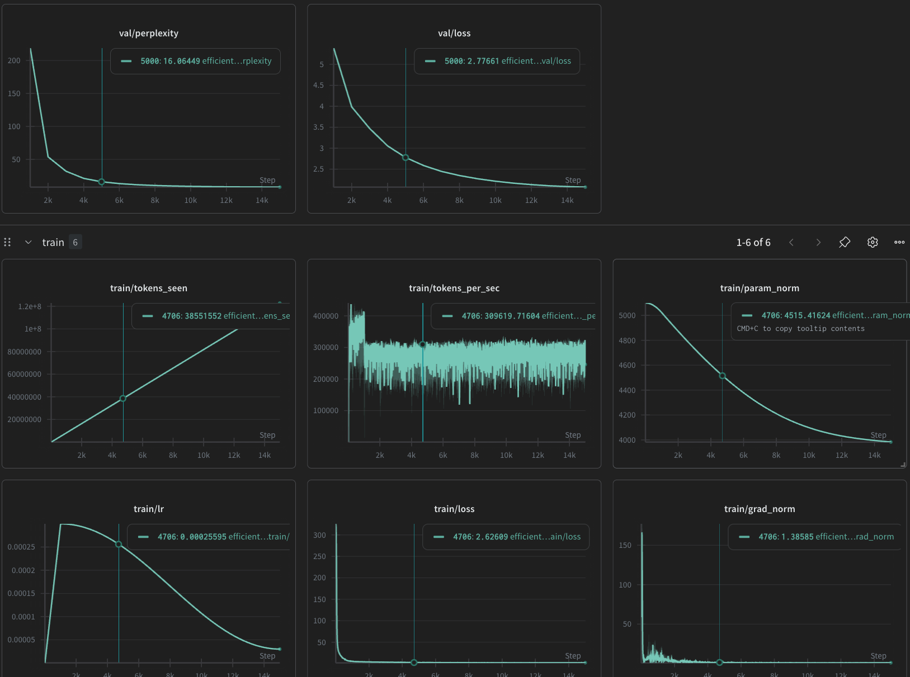

# GPT-2 on TinyStories

Clean implementation of GPT-2 trained on [TinyStories](https://huggingface.co/datasets/roneneldan/TinyStories). This version uses an **8-layer, 512-dim** transformer with `torch.compile` and mixed-precision training.
****

## Training Results (W&B)

The model was trained for 15,000 steps. The following logs show the convergence and gradient stability throughout the run.



## Checkpoints

| Version | Description | Download |
| --- | --- | --- |
| **Best Model** | Lowest validation loss during training. | [Download .pth](https://drive.google.com/file/d/1FocXa_9nBluhLdPIkAXGnlpwW7lUlWkl/view?usp=sharing) |
| **Final Model** | State at Step 15k. | [Download .pth](https://drive.google.com/file/d/1ZRZtEb_O2eEl-LScqQ3m56oJGbfr5KVN/view?usp=sharing) |

## Sample Generations

```text
PROMPT: Timmy found a shiny blue
RESPONSE:  blanket and started to play with it. They took turns pushing and have fun.

After that day, Timmy and his mommy played with the blue blanket all day long. They had a great time playing with the red blanket while Timmy saw the blue blanket in the park. He was so happy that he could play with his blanket all day

---

PROMPT: In the deep dark forest, a
RESPONSE:  little girl came to pick some water. She took the cloth and put it in the air. She was so happy!

The cow saw the little girl and ran to her house. She was very excited to see the colorful planet in the middle of the woods. When she got there, she was so happy that the cow had brought her.

The cow was very thoughtful and it could finally be its friend. The cow ran off to find her and they both knew that she would never forget her special friend.

---

PROMPT: One day, a cat met a
RESPONSE:  sad cat. The cat was sad because the cat had lost its ball. The cat wanted to help the cat.
The cat's owner, the cat, saw the cat and started to play. The cat was happy and said, "Thank you, cat!" The cat and the cat played with the ball all day and had lots
 of fun
```

## Architecture & Config

* **Model:** GPT-2 (Decoder-only)
* **Parameters:** ~50M
* **Layers:** 8
* **Heads:** 8
* **Embed Dim:** 512
* **Context Window:** 512 tokens

## Usage

```bash
uv sync                           # Install dependencies
python scripts/prepare_data.py    # Tokenize dataset
python train.py                   # Start training
python generate.py                # Run inference

```

Refernces:

1. Karpathy, A. (2023). *NanoGPT*. GitHub repository. <https://github.com/karpathy/nanoGPT>

2. Vaswani, A., Shazeer, N., Parmar, N., Uszkoreit, J., Jones, L., Gomez, A. N., Kaiser, Ł., & Polosukhin, I. (2017). *Attention Is All You Need*. Advances in Neural Information Processing Systems (NeurIPS). <https://arxiv.org/abs/1706.03762>

3. Radford, A., Wu, J., Child, R., Luan, D., Amodei, D., & Sutskever, I. (2019). *Language Models are Unsupervised Multitask Learners*. OpenAI. <https://cdn.openai.com/better-language-models/language_models_are_unsupervised_multitask_learners.pdf>
